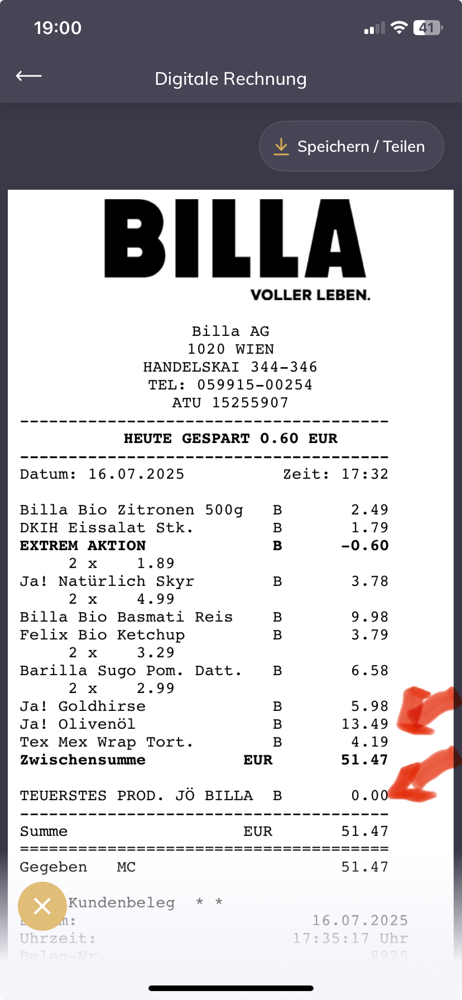

# Lab 2 – Bug Report (JÖ Bonus Club)

## 🐞 Bug Summary

In the JÖ Bonus Club app, the 30% discount for the most expensive product was not applied during a purchase at BILLA on 16.07.2025.

---

## 📋 Reproduction Steps

1. Open the JÖ Bonus Club app.
2. Tap on "JÖ Partner" and select "Billa & Billa Plus".
3. Select the 30% discount for the most expensive product and scan it.
4. Scan your JÖ Karte.
5. Scan multiple products, including one expensive item (e.g., olive oil for €13.49).
6. Complete the purchase.

---

## ✅ Expected Result

The 30% discount should be applied to the most expensive item in the purchase.

---

## ❌ Actual Result

The discount was not applied.  
On the digital receipt, the entry "TEUERSTES PROD. JÖ BILLA" shows a €0.00 discount.

---

## 📷 Screenshot

---

## 🧪 Environment

- **App**: JÖ Bonus Club  
- **Store**: BILLA (Filiale: 00254)  
- **Date**: 16.07.2025  
- **Time**: 17:32  
